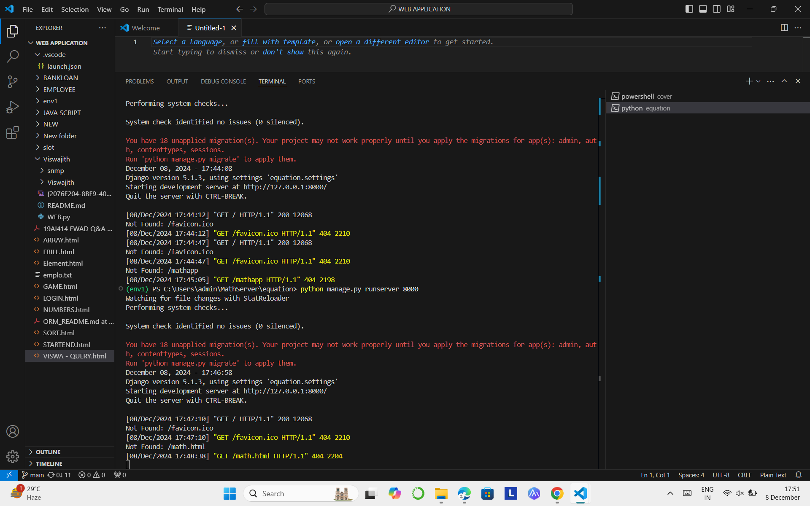
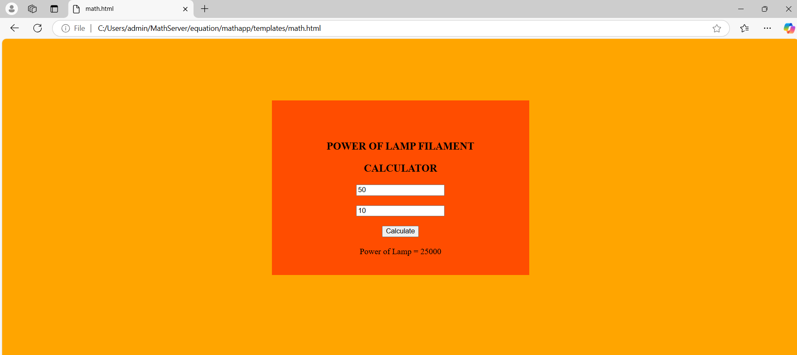

# Ex.05 Design a Website for Server Side Processing
## Date: 08 / 12 / 2024

## AIM:
 To design a website to calculate the power of a lamp filament in an incandescent bulb in the server side. 


## FORMULA:
P = I<sup>2</sup>R
<br> P --> Power (in watts)
<br> I --> Intensity 
<br> R --> Resistance

## DESIGN STEPS:

### Step 1:
Clone the repository from GitHub.

### Step 2:
Create Django Admin project.

### Step 3:
Create a New App under the Django Admin project.

### Step 4:
Create python programs for views and urls to perform server side processing.

### Step 5:
Create a HTML file to implement form based input and output.

### Step 6:
Publish the website in the given URL.

## PROGRAM :
```
math.html


<html>
    <head>
        <style>
            .Calculate
            {
                width: 30%;
                padding: 20px;
                margin: auto;
                background-color: rgb(255, 77, 0);
            }
            p
            {
                font-size: 20px;
                font-weight: bold;
                bottom: 1px;
            }
        </style>
        <script>
            function power()
            {
                var i = Number(document.getElementById('t1').value);
                var r = Number(document.getElementById('t2').value);
                var p = i*i*r;
                document.getElementById('power').innerText="Power of Lamp = "+p;
            }
        </script>
    </head>
    <body bgcolor="orange" align="center">
        <br><br><br><br><br><br>
        <div class="Calculate">
            <br><br>
            <p>POWER OF LAMP FILAMENT </p><p>CALCULATOR<p>
            <form>
                <input type="number" placeholder="Enter Intensity" id="t1"><br><br>
                <input type="number" placeholder="Enter Resistance" id="t2"><br><br>
                <input type="button" value="Calculate" onclick="power()"><br><br>
                <label id="power"></label>
            </form>
        </div>
    </body>
</html>

```

## SERVER SIDE PROCESSING:



## HOMEPAGE:



## RESULT:
The program for performing server side processing is completed successfully.
